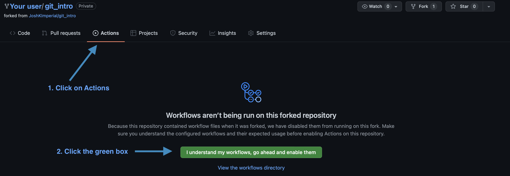
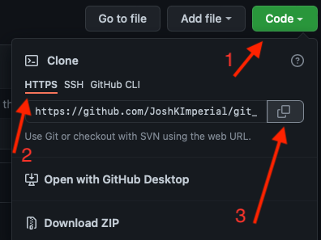
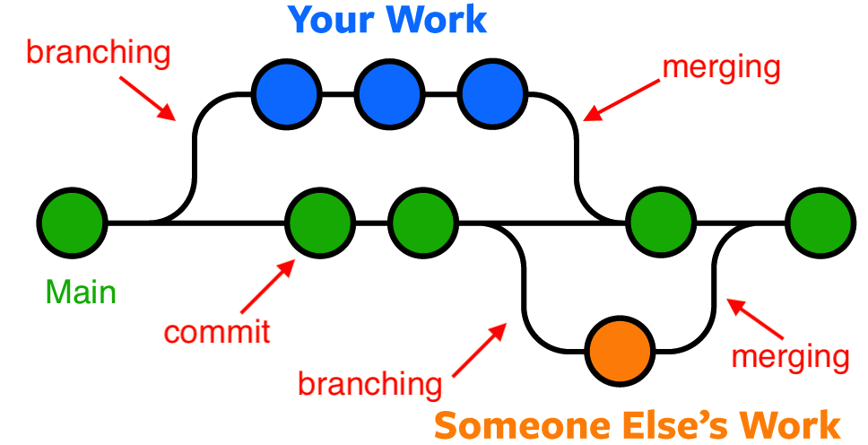

# An introduction to git!

## What is git?
Git is a convenient way to keep track of files, typically code. In it's most basic implementation you:
1. Tell it which files to track
2. Make checkpoints as you improve your code

That's it!

## So, what is GitHub? :thinking:
When using git you are keeping track of all your files, however, they are only stored on your computer. We can use git to *push* your code to a *remote*, GitHub is an example of a *remote*

### Compared to OneDrive/Dropbox/...
Think of git as being like OneDrive without an internet connection, it still keeps track of your files and knows what has been changed. When you connect to the internet it then uploads your files to OneDrive, this is the equivalent of GitHub.

## Git seems complicated

Git can seem complex at first for two main reasons:
   1. Git's nomenclature can be daunting intially, but once you get a grasp of it it begins to make sense. Hopefully, by completing this tutorial you'll gain a familiarity with the main terms used.
   2. There are lots of ways to utilise git with users typically using their preferred method; although sometimes the *command line* is your only option and it has the best online support. As such, in this tutorial we will use the command line and GitHub.com where possible. 
 
## Tutorial syllabus

In this tutorial we will cover the following topics:  
**forking**: Creating your own copy of a *repo*  
**cloning**: Downloading a *repo*  
**branching**: We may have a main *branch*, this contains code we are happy with. If we want to try something out we can create a branch, this gives us a new copy of the *repo*. If we like our changes we can *merge* them back into the main *branch*. For us our main *branch* could be reserved for code which has been used for a submitted paper.  
**adding**: Use `git add {my_file.py}` to tell git to keep track of this file  
**commiting**: When you want to checkpoint a file you *commit* it with `git commit {my_file.py}`  
**pushing**: When you've made a few changes, or want to show someone else your code you can push it to a *remote* using `git push`  
**merging**: If you have made a *branch* and are happy with it you can *merge* it back into the main *branch*  
**history**: You can review the git *history* to see what has been *committed* over time  
**reverting**: Sometimes *commits* can introduce problems, these can be found by reviewing the *history* and then *reverted*  
**issues**: If you're having problems with somebody else's code, it is good practice to write an *issue*, someone can then try to fix this *issue*  

## Setting up git and GitHub

1. Create a GitHub account [here](https://github.com/signup?ref_cta=Sign+up&ref_loc=header+logged+out&ref_page=%2F&source=header-home)
2. To install Git go to [git-scm.com](https://git-scm.com/downloads), it is usually already installed on Mac and Linux
   You now have an account setup with a *remote* and git installed on your computer, we must now link the two, this isn't something you'll do regularly. The easiest way varies between operating systems:

### On windows [video tutorial](https://www.youtube.com/watch?v=3FNA2hWG-Bk)
1. Complete parts 1 and 2 of [tasks](##-Tasks)
2. As you run `git clone` a dialog will appear prompting you to login to GitHub, once you've down this the *repo* will download and you're sorted

### On Mac and Linux
1.  Install the [GitHub Command Line](https://cli.github.com) from here:
2.  In terminal run `gh auth login -w`
3.  You'll now be prompted to login to GitHub, once done you're sorted.
4. There are numerous ways to interact with git, as mentioned in [Git seems complicated](#git-seems-complicated) we will use the *command line* and GitHub.com

**Need to decide how they should interact with git, git bash requires understanding cd**

## Tasks

This example uses python, but you can use any language just ensure the filename is `foo.{extension}`, e.g. `foo.py`, `foo.m`

1. *fork* this repository
   1. For this tutorial to work you need to enable GitHub actions, do this by 
2. *clone* your *fork* of this repository
   1. 
      1. This copies the *repos* url
   2. Go to where you want to store the repo and run `git clone {repo_url}`
      1. **Maybe need a video on navigating in the command line**
      2. All future git commands will assume you're in your in this folder
3. Create a new *branch* for you to make your changes, call it `adding_foo`
   1. First use `git branch adding_foo` to create a new branch
   2. Use `git checkout adding_foo` to use your new branch
4. In your *repo* create a new file `foo.py`, write a function which squares its input
   1. Tell git to add your changes with `git add foo.py`
   2. *Commit* this file with `git commit -m "Added a function which squares its inputs"`
5. Add to the file a new function which sums its inputs
   1. Run `git status`, here you can see your new function has been added
   2. Now use `git add foo.py` and`git commit -m "Added a function for summing inputs"`
6. Add a third function which subtracts its inputs
   1. Re-run step 4's indented points
7. Run `git push` to upload your changes to GitHub
8. *merge* your *branch* back into main to mark your work, after a minute refresh the readme

## Glossary

Git is a well thought out platform, however, it does come with some unusual nomenclature.

* *Add* - Tell git to track a file, e.g. `git add foo.py`
* *Branch* - Create a copy of the *repo* which you can use to test new features while not breaking the main *repo*. See image below.
* *Clone* - Download a git *repo* `git clone {repo_url}`
* *Commit* - Creating a checkpoint in the *repos* timeline, usually has an accompanying message `git commit foo.py -m "Your commit message"`
* *Command Line* - The command line is the most fundamental way to interact with your computer, in Mac and Linux you access it via 'terminal' while in Windows you'll likely want 'powershell'
* *Fork* - Create your own copy of a *repo*
* *History* - A record of all the *commits* in this *repo*. Useful for reviewing what has been done.
* *Issue* - If you're having problems with somebody else's code, it is good practice to write an *issue*
* *Merge* - If you have made a *branch* and are happy with it you can *merge* it back into the main *branch*
* *Repo* - repository - essentially a folder containing code
* *Remote* - An online service which stores your code, typically GitHub
* *Revert* - *Reverting* a *commit* effectively deletes what was changed in that *commit*
* *Status* -
* *Push* - Upload the *repo* in it's current state to the *remote* `git push`

