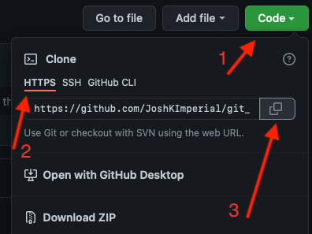

# An introduction to git!

## What is git?
Git is a convenient way to keep track of files, typically code. In it's most basic implementation you:
1. Tell it which files to track
2. Make checkpoints as you improve your code

That's it!

## So, what is GitHub? :thinking:
When using git you are keeping track of all your files, however, they are only stored on your computer. We can use git to *push* your code to a *remote*, GitHub is an example of a *remote*

### Compared to OneDrive
Think of git as being like OneDrive without an internet connection, it still keeps track of your files and knows what has been changed. When you connect to the internet it then uploads your files to OneDrive, this is the equivalent of GitHub.
 
## Tutorial syllabus

In this tutorial we will cover the following topics:  
**forking**: Creating your own copy of a *repo*  
**cloning**: Downloading a *repo*  
**branching**: We may have a main *branch*, this contains code we are happy with. If we want to try something out we can create a branch, this gives us a new copy of the *repo*. If we like our changes we can *merge* them back into the main *branch*. For us our main *branch* could be reserved for code which has been used for a submitted paper.  
**adding**: Use `git add {my_file.py}` to tell git to keep track of this file  
**commiting**: When you want to checkpoint a file you *commit* it with `git commit {my_file.py}`  
**pushing**: When you've made a few changes, or want to show someone else your code you can push it to a *remote* using `git push`  
**merging**: If you have made a *branch* and are happy with it you can *merge* it back into the main *branch*  
**history**: You can review the git *history* to see what has been *committed* over time  
**reverting**: Sometimes *commits* can introduce problems, these can be found by reviewing the *history* and then *reverted*  
**issues**: If you're having problems with somebody else's code, it is good practice to write an *issue*, someone can then try to fix this *issue*  

## Setting up git and GitHub

1. Create a GitHub account [here](https://github.com/signup?ref_cta=Sign+up&ref_loc=header+logged+out&ref_page=%2F&source=header-home)
<!-- 2. Git is based on the command line, however, there are a number of Graphical User Interfaces (GUIs) you can use. -->
2. The 
3. To install Git go to [git-scm.com](https://git-scm.com/downloads), it is usually already installed on Mac and Linux
4. To interact with git
   1. Windows: 

**Need to decide how they should interact with git, git bash requires understanding cd**

## Tasks

1. *fork* this repository
2. Create a new *branch* for you to make your changes
3. *clone* your *fork* of this repository
   1. 
      1. This copies the *repos* url
   2. **Go to where you want to store the repo** depends on how they intreact with git
4. Create a new file `foo.py`, and write a function which squares its input
   1. Tell git to track this file with `git add foo.py`
   2. *Commit* this file with `git commit`
5. Add to the file a new function which sums its inputs
   1. Run `git status`, here you can see your new function has been added
   2. Now use `git commit foo.py -m "Added a function for summing inputs"`
6. Add a third function which subtracts its inputs
   1. Re-run step 4's indented points
7. Run `git push` to upload your changes to GitHub
8. *merge* your *branch* back into main to mark your work, after a minute refresh the readme
   1. Viewing your repo in Github, clicking on ‘commits’ will let you view the repos history
9. 

## Glossary

* Repo - repository - essentially a folder containing code
* *remote* - An online service which stores your code, typically GitHub
